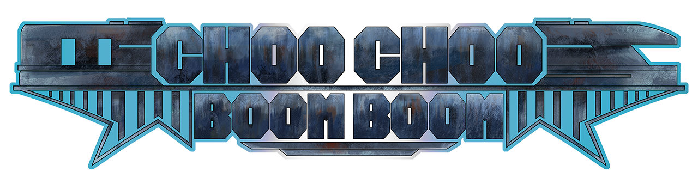

# 

<body id="CCBB-page">
    <table>
    <tr>
        <td colspan="1" style="text-align: center;">
        <b>
            Choo Choo Boom Boom was the project I worked on for the second semester of my senior year. I was onboarded onto the game's already existing team along with several others at the beginning of the semester. I was recruited to help out the other two programmers that were already a part of the team polish and further the game’s already existing systems while also being tasked with leading the charge on creating new systems of my own both independently and alone side the rest of the team. These systems and some of the highlight experiences of this project is what I’ll be discussing here.
        </b>
        </td>
    </tr>
    </table>
</body>

## Scoring System, Rotating Counter Ui, Leaderboard Data Base Systems
<table>
    <tr>
        <td colspan="1" style="text-align: center;">
        <b>
            This was the first system that I was tasked with developing for this project. I had to create the systems that handled score updating, integrating all of the game's significant events into the score system, displaying score updates through the game's UI, and integrating sounds and player feedback for the scoring system. Choo Choo Boom Boom was always planned to be an on-rails shooter arcade game, and what arcade game is complete without a way to compete for high scores? I wanted the score system to reward the player for doing well in the game, and since the goal is to get a high score, I thought what better way to reward the player than by giving them more score.
             
            <video controls width = "800" height = "600">
                <source src=".\assets\videos\CCBBDemos\CCBBScoreSample.mp4" type="video/mp4">
            </video>
             
             Read the full official documentation for how I accomplished this <a href="https://docs.google.com/document/d/1dQhFmTaI_uBz6Q1KBg_msHWr8LCmrlmBEDX2CJVSHTA/edit?usp=sharing" target="_blank">here!</a>
        </b>
        </td>
    </tr>
</table>

## Game Ui
<table>
    <tr>
        <td colspan="1" style="text-align: center;">
        <b>
            In addition to creating the scoring system UI I was also tasked with creating the systems to handle the other adaptive aspects of the UI, namely the health display, boss health bar, players entering their initials at the end of the game, tallying up the player's final score at the end of the game, implmenting the sounds necessary to increase player feedback, retrieving and displaying the top 10 highest scores in the database, and handing the uploading of new scores to the database.
             
            <video controls width = "800" height = "600">
                <source src=".\assets\videos\CCBBDemos\CCBBEndUiDemo.mp4" type="video/mp4">
            </video>
             
            Read the full official documentation for how I accomplished this <a href="https://docs.google.com/document/d/1dQhFmTaI_uBz6Q1KBg_msHWr8LCmrlmBEDX2CJVSHTA/edit?usp=sharing" target="_blank">here!</a>
        </b>
        </td>
    </tr>
</table>

## In-Game Settings Systems
<table>
    <tr>
        <td colspan="1" style="text-align: center;">
        <b>
            For this I was tasked with adding and refining the already existing settings menu by adding a reticle sensitivity slider and a debugging menu for the team to make the testing process easier. To stay in-line with the arcade vibe of this game, I came up with the idea of keeping the debugging menu in the game after release and allowing players to access it in game by using the Konami code on the settings menu.
             
            <video controls width = "800" height = "600">
                <source src=".\assets\videos\CCBBDemos\CCBBCheatCodeMenu.mp4" type="video/mp4">
            </video>
             
            <video controls width = "800" height = "600">
                <source src=".\assets\videos\CCBBDemos\CCBBSensitivity.mp4" type="video/mp4">
            </video>
             
            Read the full official documentation for how I accomplished this <a href="https://docs.google.com/document/d/1dQhFmTaI_uBz6Q1KBg_msHWr8LCmrlmBEDX2CJVSHTA/edit?usp=sharing" target="_blank">here!</a>
        </b>
        </td>
    </tr>
</table>

## Attract Mode System

<table>
    <tr>
        <td colspan="1" style="text-align: center;">
        <b>
            No arcade cabinet is complete without its own attract mode, in case you’re unaware of what an attract mode is, an attract mode is a sort of “demo mode” that an arcade machine will enter when it is on the title screen and is not being actively used. While in this mode, the cabinet screen will display a demo of gameplay so that it can “attract” people walking by the cabinet to play it. I was tasked with creating the systems necessary to replicate this key part of arcade culture within Choo Choo Boom Boom.
             
            <video controls width = "800" height = "600">
                <source src=".\assets\videos\CCBBDemos\CCBBAttractScreenDemo.mp4" type="video/mp4">
            </video>
             
            Read the full official documentation for how I accomplished this <a href="https://docs.google.com/document/d/1eOQ8ZaAhFawH2oGGQtuxxI6bxyqWcSVXsQXDlW71Wl8/edit?usp=sharing" target="_blank">here!</a>
        </b>
        </td>
    </tr>
</table>

[Back to projects page](./projects-page.html)
