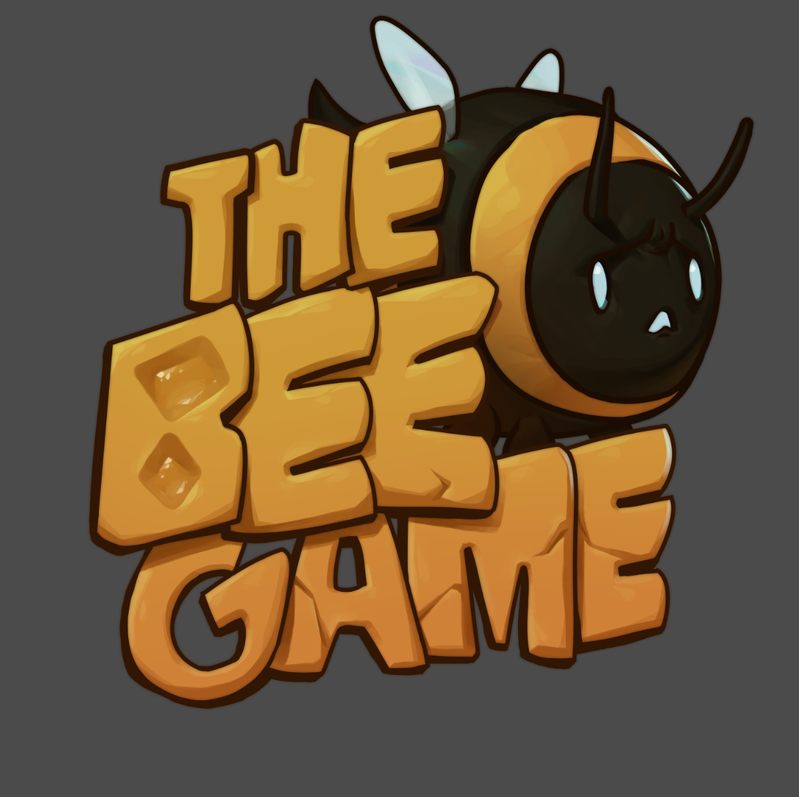

 # 

<body id="bee-game-page">
    <table>
    <tr>
        <td colspan="1" style="text-align: center;">
        <b>
        Try it out on itch.io <a href="https://quackennn.itch.io/bee-game" target="_blank">here!</a>
        </b>
        </td>
    </tr>
    </table>
        
</body>

[Back to projects page](./projects-page.html)
