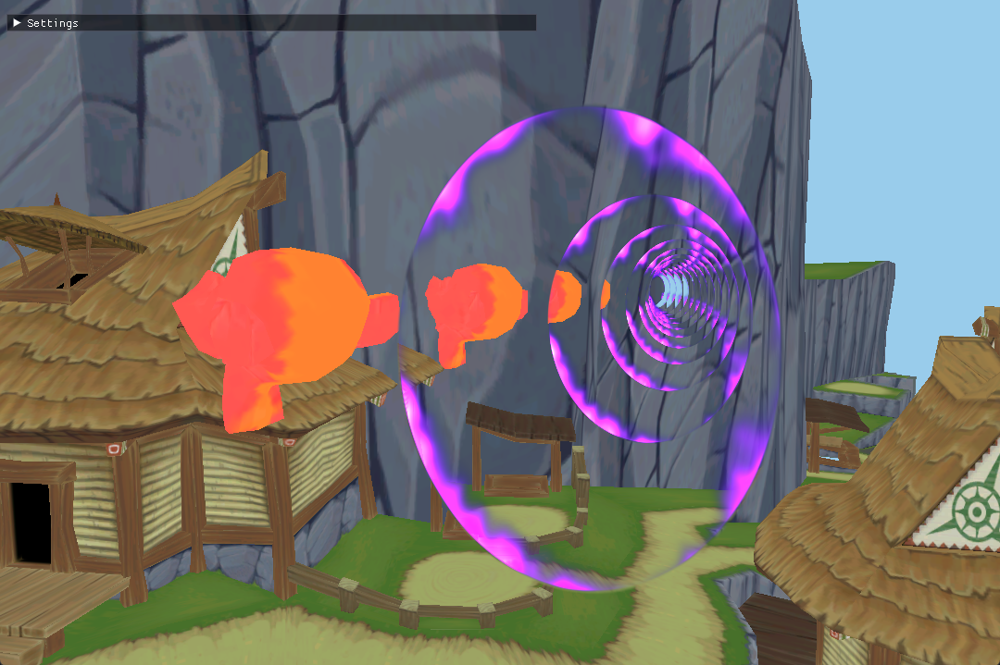
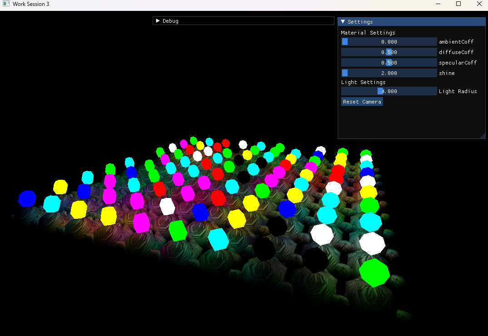

# **Welcome to the C++ Projects Page!!!**

<table>
  <tr>
    <td colspan="1" style="text-align: center;">
    <b>Here you can find all of the projects I have worked on that have primarily or entirely involved C++ programming!
     
    This page is just a small snippet of the projects I have worked on, after you're done here make sure to checkout my full project page <a href="./projects-page.html">here!</a> to see a comprehensive list of all my currently public projects!!!
     
    If you're looking for my list of Unreal Engine projects you can find them <a href="./unreal-projects-page.html">here!</a>
    </b>
    </td>
  </tr>
</table>

## Portals in Open GL, 2025 Spring Semester

<table>
  <tr>
    <td colspan="1" style="text-align: center;">
    <b>
    I utilized C++ and OpenGL to create a portal shader that utilizes multiple framebuffers to render and orient multiple instances of a scene within the bounds of a portal all while offering realtime customization of the portal’s rotation, position, and recursion amount. Click the link down below to downlaod the finished project!!! (You will need visual studio, with CMake tools installed, and will need to open the folder as a CMake project in visual studio, then select the "FinalPortal.exe" startup item)
     
     
    Learn more about this Open GL Portals project and what I did on it <a href="./open-gl-portals-page.html">here!</a>
     
    
    </b>
    </td>
  </tr>
</table>

## Open-GL Deferred Shading, 2025 Spring Semester

<table>
  <tr>
    <td colspan="1" style="text-align: center;">
    <b>
    I utilized C++ and OpenGL to create a scene utilizing deffered shading, which is a 3D rendering technique that decouples scene geometry processing from lighting calculations, significantly optimizing scenes with high light counts. This is accomplished by storing geometric data—positions, normals, and material properties—into a G-buffer during a first pass, lighting is computed only for visible pixels in a second pass, enabling hundreds or thousands of light sources at high frame rates.
     
     
    Learn more about this Deferred Shading project <a href="./open-gl-deferred-shading-page.html">here!</a>
     
    
    </b>
    </td>
  </tr>
</table>

[Back to home page](./)
