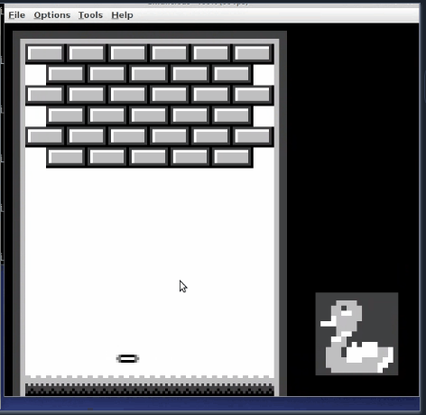
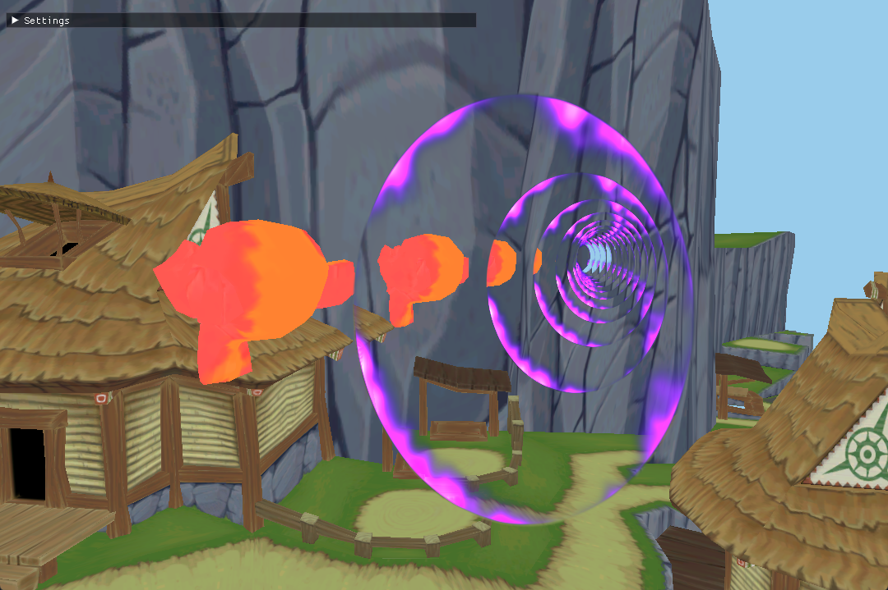
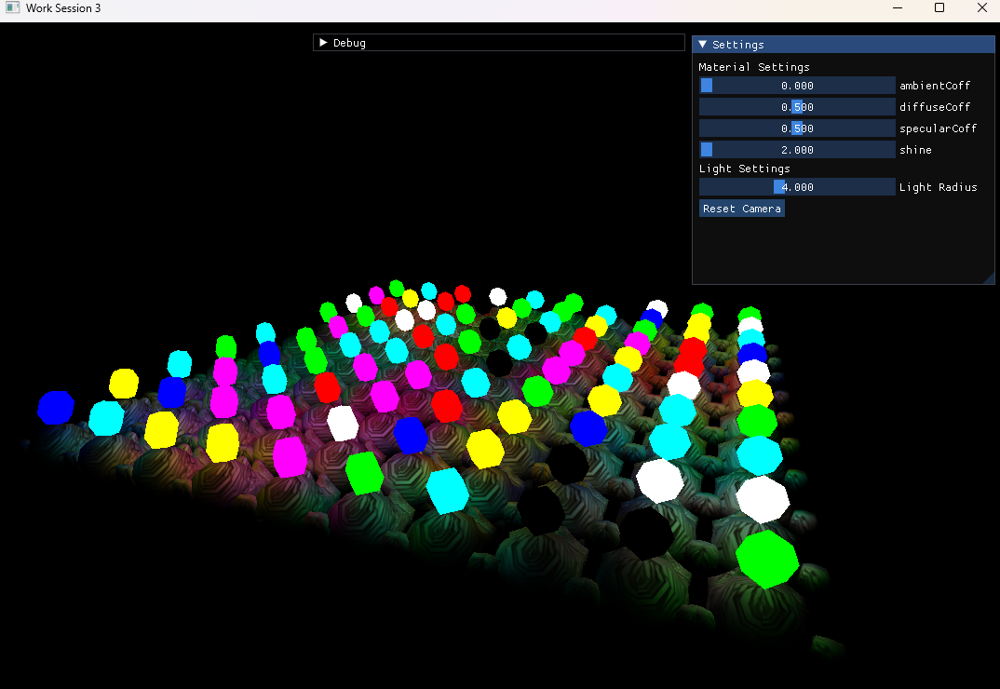
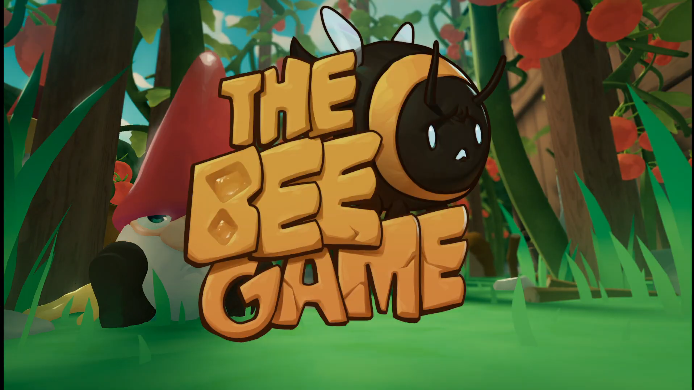
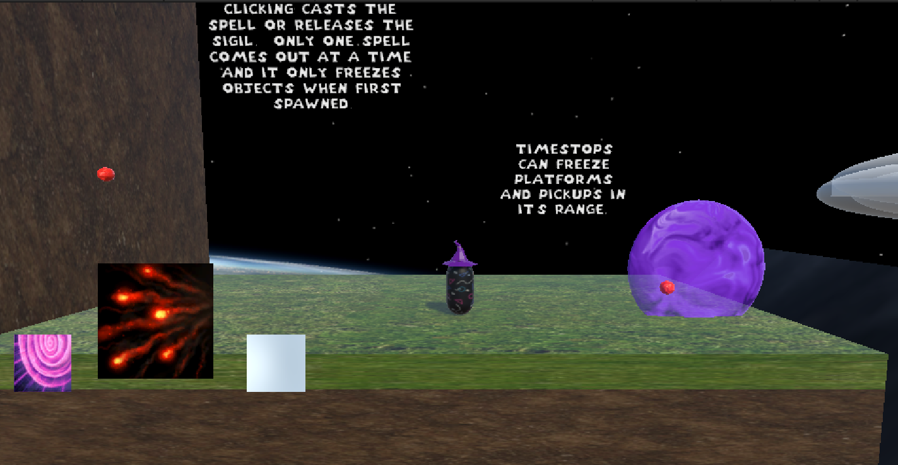
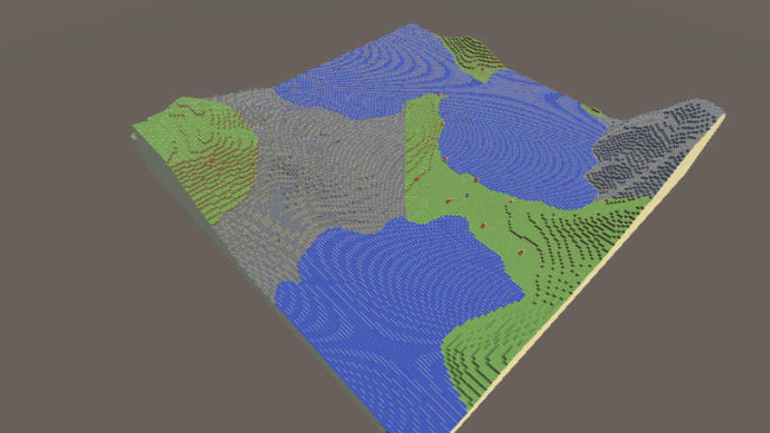

# Welcome to the Projects Page!!!

<table>
  <tr>
    <td colspan="1" style="text-align: center;">
    <b>Over the course of my game development career I have worked on a number of different projects within both 2D and 3D environments, spanning multiple game engines, programming languages, and topics. Below is an almost comprehensive list of all of the projects I have worked on over the years, along with some plans for future ones as well, so take a look around and hopefully you’ll find a project that catches your eye!
    </b>
    </td>
  </tr>
</table>

# Choo Choo Boom Boom, 2026 Spring Semester (Still in development!)

<table>
  <tr>
    <td colspan="1" style="text-align: center;">
    <b>
    Choo Choo Boom Boom is an on rails shooter in which you are on a train equipped with cannons trying to take out an otherworldly entity that is attacking your city. Choo Choo Boom Boom stemmed from the idea of what would be a literal on rails shooter. You can’t get more on rails than a train. So we took that train and strapped an explosive cannon on it.
     
    [Link to another page](./youreit-page.html).
    Learn more about Choo Choo Boom Boom and what I did on it <a href="./CCBB-page.html">here!</a>
     
    </b>
    <video controls width = "800" height = "600">
      <source src=".\assets\videos\ChooChooBoomBoom_UpdatedTrailer.mp4" type="video/mp4">
      </video>
    </td>
  </tr>
</table>

# You're It!, 2025 Fall Semester (Still in development!)
<table>
  <tr>
    <td colspan="1" style="text-align: center;">
    <b>
    You're It! is a 4 player local and online multiplayer game that seeks to reinvigorate that feeling you would be chasing on the playground during recess while playing tag with your classmates. Chase your friends around the playground and tag them by jumping, sliding, diving, and pushing your way to victory in one of three action packed tagging game modes, all fully customizable to your hearts desire! Be warned, for every second you're it, your timer will go down, run out of time, and you're out! Be the last one or last team left standing to win!
     
    Learn more about You're It! and what I did on it <a href="https://goobydaniels.github.io/youreit-page.html" target="_blank">here!</a>
    <video controls width = "800" height = "600">
      <source src=".\assets\videos\TrailerTest2.mp4" type="video/mp4">
    </video>
    </b>
    </td>
  </tr>
</table>

# Brick Bash GameBoy Game, 2025 Fall Semester
<table>
  <tr>
    <td colspan="1" style="text-align: center;">
    <b>
    This project was my final for my Computer Architecture class. The underlying requirement for this final was to utilize assembly programming in some kind of long term project, many options were presented to me but I chose to take on the challenge of making a Game Boy game, which are all completely written in assembly.
     
    You can read about my process while making this project and download the final project here: (You will need a Game Boy emulator to actually play the game!!! For the project I used Emulicious)
     
    Learn more about this Gameboy project and what I did on it <a href="https://goobydaniels.github.io/brick-bash-page.html" target="_blank">here!</a>
     
    
    </b>
    </td>
  </tr>
</table>

# Portals in Open GL, 2025 Spring Semester

<table>
  <tr>
    <td colspan="1" style="text-align: center;">
    <b>
    I utilized C++ and OpenGL to create a portal shader that utilizes multiple framebuffers to render and orient multiple instances of a scene within the bounds of a portal all while offering realtime customization of the portal’s rotation, position, and recursion amount. Click the link down below to downlaod the finished project!!! (You will need visual studio, with CMake tools installed, and will need to open the folder as a CMake project in visual studio, then select the "FinalPortal.exe" startup item)
     
    Learn more about this Portals project and what I did on it <a href="https://goobydaniels.github.io/open-gl-portals-page.html" target="_blank">here!</a>
     
    
    </b>
    </td>
  </tr>
</table>

# Open-GL Deferred Shading, 2025 Spring Semester

<table>
  <tr>
    <td colspan="1" style="text-align: center;">
    <b>
    I utilized C++ and OpenGL to create a scene utilizing deffered shading, which is a 3D rendering technique that decouples scene geometry processing from lighting calculations, significantly optimizing scenes with high light counts. This is accomplished by storing geometric data—positions, normals, and material properties—into a G-buffer during a first pass, lighting is computed only for visible pixels in a second pass, enabling hundreds or thousands of light sources at high frame rates.
     
    Learn more about this Deferred Shading project <a href="https://goobydaniels.github.io/open-gl-deferred-shading-page.html" target="_blank">here!</a>
     
    
    </b>
    </td>
  </tr>
</table>

# Domain Expansion, 2025 Global Game Jam

<table>
  <tr>
    <td colspan="1" style="text-align: center;">
    <b>
    Domain Expansion is CrabTap Studios' submission for the 2025 Global Game Jam. The game is a chaotic tycoon like experience where you try to buy and sell as many DOT COM (.com) domains (urls) as you can before the .com bubble bursts. Based on what topics are currently trending, domains that are related to those trends will make more money. Try to make as much money as possible as you manage buying and selling domains while putting up with annoying popup adds.
     
    Learn more about Domain Expansion and what I did on it <a href="https://goobydaniels.github.io/domain-expansion-page.html" target="_blank">here!</a>
     
    
    </b>
    </td>
  </tr>
</table>

# The Bee Game, 2025 Spring Semester

<table>
  <tr>
    <td colspan="1" style="text-align: center;">
    <b>
    In Bee Game, you play as a displaced bee whose hive has been destroyed. You must fly around in a vast garden, in search of resources -- and friends -- to help repair the hive. Soar high and low in this open area adventure game, but avoid dangerous hazards looking to hinder, harm, or outright end your little bee life. Inspired by games like Pikmin, Bee Game aims to show players how hazardous the life of a bee can be, as well as what they can do to help contribute to the safety and survival of our little black and yellow friends.
     
    Learn more about The Bee Game and what I did on it <a href="https://goobydaniels.github.io/bee-game-page.html" target="_blank">here!</a>
     
    
     
    Watch the trailer <a href="https://drive.google.com/file/d/1xkSdKHElbTG6oTrUlbUfQH_S-DZw5nC7/view?usp=sharing" target="_blank">here!</a>
     
    </b>
    </td>
  </tr>
</table>

# MagicFormer, 2025 Spring Semester

<table>
  <tr>
    <td colspan="1" style="text-align: center;">
    <b>
    This project was for my Advanced Seminar Class that I took while in Montreal, in a group of three we were given the simple task of creating a game from scratch over the course of a semester. Our group choose to make a platformer with movement based of the Mario Vs. Donkey Kong game and a unique spell system that allows the player to cast various spells in order to solve puzzles!
     
    For this project we used Unity and I was in charge of creating the game's movement system, the item pick up mechanic, and various other core gameplay features.
     
    Learn more about Magicformer and what I did on it <a href="https://goobydaniels.github.io/magicformer-page.html" target="_blank">here!</a>
     
    
     
    </b>
    </td>
  </tr>
</table>

# Not Minecraft, 2024 Fall Semester

<table>
  <tr>
    <td colspan="1" style="text-align: center;">
    <b>
    This project was the final for my Game AI class where I was a part of a team of three and was tasked with creating a project that utilized multiple of the different AI systems we had learned to create throughout the class into one project. My group chose to recreate the voxel based procedural generation of Minecraft, as well as recreating the pathfinding algorithms of the villagers in Minecraft so that we could have NPC characters that can traverse the procedurally generated world along with the player.
     
    Learn more about Not Minecraft and what I did on it <a href="https://goobydaniels.github.io/not-minecraft-page.html" target="_blank">here!</a>
     
    
     
    Check out the LinkedIn post all about it <a href="https://www.linkedin.com/pulse/procedural-generation-game-ai-final-project-jerry-kaufman-hoxfc?utm_source=share&utm_medium=member_ios&utm_campaign=share_via" target="_blank">here!</a>
     
    </b>
    </td>
  </tr>
</table>

<!-- ## Procedural Mesh Generation, 2024 Fall Semester

<table>
  <tr>
    <td colspan="1" style="text-align: center;">
    <b>
    This project was for my Game AI class where I was tasked with creating any kind of procedural generation system, so I choose to utilize Unity and C# to create infinite procedural terrain generation based upon noise generated textures with color mapping based upon height maps, chunk loading, unloading, and level of detail rendering.
     
    </b>
    </td>
  </tr>
</table>

## Model Fracture Explosion Demo, 2024 Fall Semester

## Game Architecure Final, 2024 Spring Semester

## Chinese Lunar New Year Minigames, 2024 Spring Semester

## Search, 2024 Spring Semester -->

[back](./)
