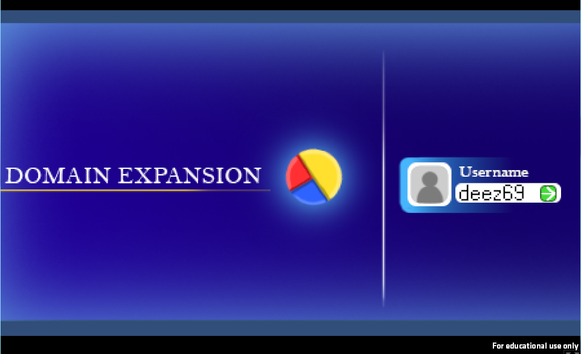
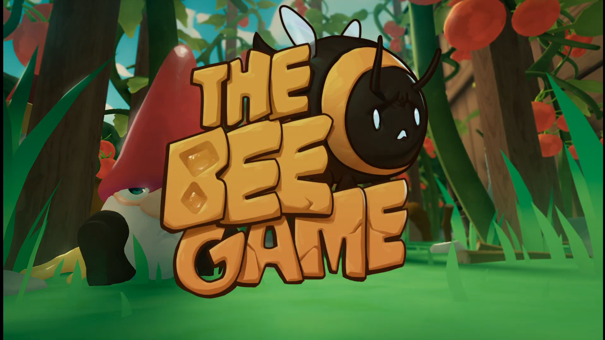
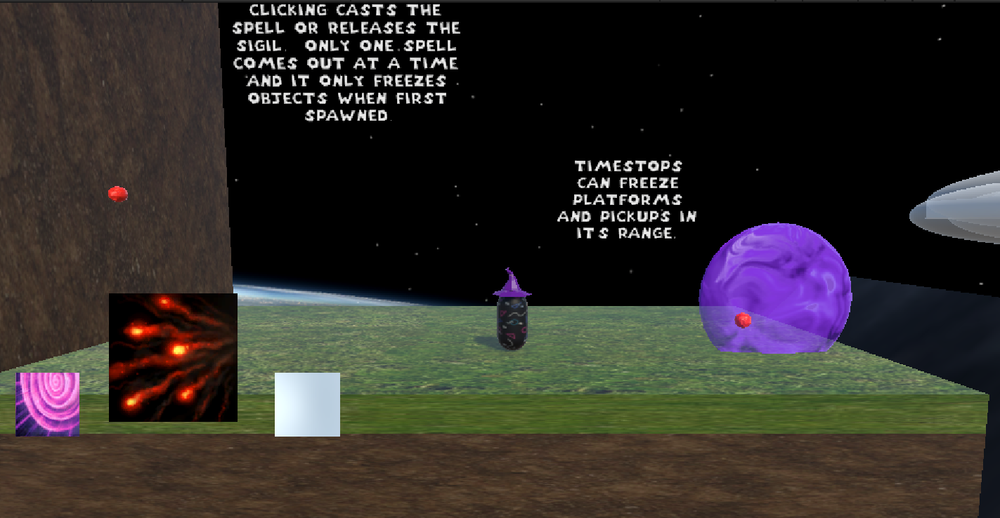
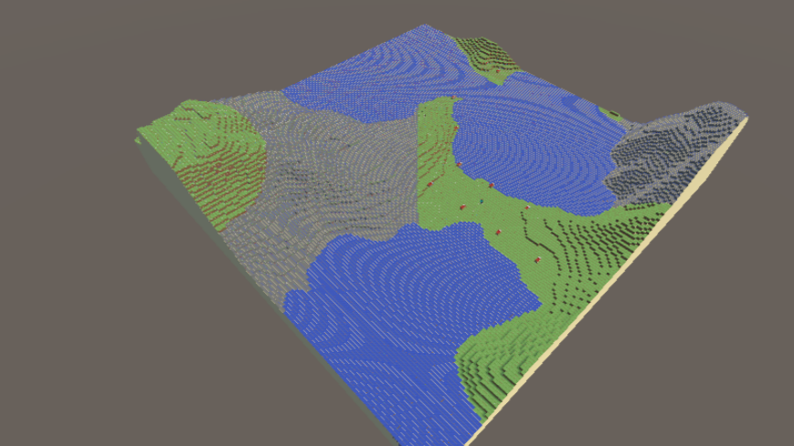

# **Welcome to the Unity / C# Projects Page!!!**

<table>
  <tr>
    <td colspan="1" style="text-align: center;">
    <b>Here you can find all of the projects I have worked on that have primarily or entirely created using the Unity game engine!
     
    This page is just a small snippet of the projects I have worked on, after you're done here make sure to checkout my full project page <a href="./projects-page.html">here</a> to see a comprehensive list of all my currently public projects!!!
    </b>
    </td>
  </tr>
</table>

## Choo Choo Boom Boom, 2026 Spring Semester (In development!)

<table>
  <tr>
    <td colspan="1" style="text-align: center;">
    <b>
    Fight through two thrilling phases of an epic boss fight as the gunner of a repurposed air train, built to take on an alien entity known only as The Hand. Blast through 10 unique encounters with your trusty set of cannons, and rack up a high score to compete with your friends!
     
     
    Learn more about Choo Choo Boom Boom and what I did on it <a href="./CCBB-page.html">here!</a>
     
    Check out the game's Steam page <a href="https://store.steampowered.com/app/4561070/Choo_Choo_Boom_Boom/" target="_blank">here!</a>
     
    </b>
    <video controls width = "800" height = "600">
      <source src=".\assets\videos\ChooChooBoomBoom_UpdatedTrailer.mp4" type="video/mp4">
      </video>
    </td>
  </tr>
</table>

## Domain Expansion, 2025 Global Game Jam

<table>
  <tr>
    <td colspan="1" style="text-align: center;">
    <b>
    Domain Expansion is CrabTap Studios' submission for the 2025 Global Game Jam. The game is a chaotic tycoon like experience where you try to buy and sell as many DOT COM (.com) domains (urls) as you can before the .com bubble bursts. Based on what topics are currently trending, domains that are related to those trends will make more money. Try to make as much money as possible as you manage buying and selling domains while putting up with annoying popup adds.
     
     
    Learn more about Domain Expansion and what I did on it <a href="./domain-expansion-page.html">here!</a>
     
    
    </b>
    </td>
  </tr>
</table>

## The Bee Game, 2025 Spring Semester

<table>
  <tr>
    <td colspan="1" style="text-align: center;">
    <b>
    In Bee Game, you play as a displaced bee whose hive has been destroyed. You must fly around in a vast garden, in search of resources -- and friends -- to help repair the hive. Soar high and low in this open area adventure game, but avoid dangerous hazards looking to hinder, harm, or outright end your little bee life. Inspired by games like Pikmin, Bee Game aims to show players how hazardous the life of a bee can be, as well as what they can do to help contribute to the safety and survival of our little black and yellow friends.
     
     
    Learn more about The Bee Game and what I did on it <a href="./bee-game-page.html">here!</a>
     
    
     
    Watch the trailer <a href="https://drive.google.com/file/d/1xkSdKHElbTG6oTrUlbUfQH_S-DZw5nC7/view?usp=sharing" target="_blank">here!</a>
     
    </b>
    </td>
  </tr>
</table>

## MagicFormer, 2025 Spring Semester

<table>
  <tr>
    <td colspan="1" style="text-align: center;">
    <b>
    This project was for my Advanced Seminar Class that I took while in Montreal, in a group of three we were given the simple task of creating a game from scratch over the course of a semester. Our group choose to make a platformer with movement based of the Mario Vs. Donkey Kong game and a unique spell system that allows the player to cast various spells in order to solve puzzles!
     
    For this project we used Unity and I was in charge of creating the game's movement system, the item pick up mechanic, and various other core gameplay features.
     
     
    Learn more about Magicformer and what I did on it <a href="./magicformer-page.html">here!</a>
     
    
     
    </b>
    </td>
  </tr>
</table>

## Not Minecraft, 2024 Fall Semester

<table>
  <tr>
    <td colspan="1" style="text-align: center;">
    <b>
    This project was the final for my Game AI class where I was a part of a team of three and was tasked with creating a project that utilized multiple of the different AI systems we had learned to create throughout the class into one project. My group chose to recreate the voxel based procedural generation of Minecraft, as well as recreating the pathfinding algorithms of the villagers in Minecraft so that we could have NPC characters that can traverse the procedurally generated world along with the player.
     
     
    Learn more about Not Minecraft and what I did on it <a href="./not-minecraft-page.html">here!</a>
     
    
     
    Check out the LinkedIn post all about it <a href="https://www.linkedin.com/pulse/procedural-generation-game-ai-final-project-jerry-kaufman-hoxfc?utm_source=share&utm_medium=member_ios&utm_campaign=share_via" target="_blank">here!</a>
     
    </b>
    </td>
  </tr>
</table>

[Back to home page](./)
