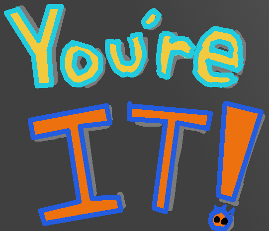

# 

<body id="youre-it-page">
    <table>
        <tr>
            <th class = "frutiger-aero-header" colspan="1" style="text-align: center;">
            <h1>You're It!</h1>
            </th>
        </tr>
    <tr>
        <td colspan="1" style="text-align: center;">
        <b>
        You're It! Is a game concept of my own creation that I have been developing for the better part of a year alongside an ever expanding team, but before I was given the opportunity to properly begin its development with a team, I had developed a small prototype for it as a way to familiarize myself more with Unreal Engine. Then when the time came to begin the first semester of my Capstone project I pitched the idea and the prototype I had for the game to the team as a potential game that our team could develop together. After three weeks of fleshing out the prototype for You're It! we took the game prototype to be tested at the Champlain College Game Testing Labs, and You're It came back with flying colors. Those who played the prototype said that the game’s movement was incredibly fun and were clamoring for more. So with all members of the team on board with the game prototype and because of its initial reception we choose to continue developing You're It as our team's main Capstone project. I personally am continuing You're It's development as lead programmer and product owner alongside most of the original team alongside some newly on-boarded members of the team, we are planning for a release in October of 2026!
         
        I personally am continuing You're It's development, currently I am working on getting the game properly networked so that it can be played both online and locally, so look out for it on Steam in October!
         
        But for now you can try out this earlier build version on itch.io <a href="https://quackennn.itch.io/youre-it" target="_blank">here!</a>
        </b>
        </td>
    </tr>
    </table>
</body>

<table>
    <tr>
        <th class = "frutiger-aero-header" colspan="1" style="text-align: center;">
        <h2>Character Movement</h2>
        </th>
    </tr>
    <tr>
        <td colspan="1" style="text-align: center;">
        <b>
            The character movement is the core of the gameplay of You’re It! so I wanted the movement to be easy to pick up and understand initially so that players who hadn’t spent very much time playing the game could still have fun and understand most of what was going on during a game. Then from this initial understanding of the movement, the player would steadily begin to notice the less obvious mechanics present in the movement, allowing the player to slowly learn more the movement as they played and sought out a mastery of the game’s movement.
        </b>
        </td>
    </tr>
</table>

<table>
    <tr>
        <th class = "frutiger-aero-header" colspan="1" style="text-align: center;">
        <h3>Diving</h3>
        </th>
    </tr>
    <tr>
        <td colspan="1" style="text-align: center;">
        <b>
            <video controls width = "800" height = "600">
                <source src=".\assets\videos\YoureItDemos\YoureItDiveChainingDemo2.mp4" type="video/mp4">
            </video>
             
            <video controls width = "800" height = "600">
                <source src=".\assets\videos\YoureItDemos\YoureItDiveChainingDemo3.mp4" type="video/mp4">
            </video>
        </b>
        </td>
    </tr>
</table>

<table>
    <tr>
        <th class = "frutiger-aero-header" colspan="1" style="text-align: center;">
        <h3>Sliding</h3>
        </th>
    </tr>
    <tr>
        <td colspan="1" style="text-align: center;">
        <b>
            <video controls width = "800" height = "600">
                <source src=".\assets\videos\YoureItDemos\YoureItSlidingDemo.mp4" type="video/mp4">
            </video>
        </b>
        </td>
    </tr>
</table>

<table>
    <tr>
        <th class = "frutiger-aero-header" colspan="1" style="text-align: center;">
        <h3>Crouching</h3>
        </th>
    </tr>
    <tr>
        <td colspan="1" style="text-align: center;">
        <b>
            <video controls width = "800" height = "600">
                <source src=".\assets\videos\YoureItDemos\YoureItCrouchDemo.mp4" type="video/mp4">
            </video>
        </b>
        </td>
    </tr>
</table>

<table>
    <tr>
        <th class = "frutiger-aero-header" colspan="1" style="text-align: center;">
        <h3>Stun</h3>
        </th>
    </tr>
    <tr>
        <td colspan="1" style="text-align: center;">
        <b>
            <video controls width = "800" height = "600">
                <source src=".\assets\videos\YoureItDemos\YoureItHardFallDemo.mp4" type="video/mp4">
            </video>
             
            <video controls width = "800" height = "600">
                <source src=".\assets\videos\YoureItDemos\YoureItWallBonkDemo.mp4" type="video/mp4">
            </video>
        </b>
        </td>
    </tr>
</table>

<table>
    <tr>
        <th class = "frutiger-aero-header" colspan="1" style="text-align: center;">
        <h3>Slipstream</h3>
        </th>
    </tr>
    <tr>
        <td colspan="1" style="text-align: center;">
        <b>
            <video controls width = "800" height = "600">
                <source src=".\assets\videos\YoureItDemos\YoureItSlipstreamDemo.mp4" type="video/mp4">
            </video>
        </b>
        </td>
    </tr>
</table>

<table>
    <tr>
        <th class = "frutiger-aero-header" colspan="1" style="text-align: center;">
        <h2>Multiplayer</h2>
        </th>
    </tr>
</table>

<table>
    <tr>
        <th class = "frutiger-aero-header" colspan="1" style="text-align: center;">
        <h3>Local Multiplayer</h3>
        </th>
    </tr>
    <tr>
        <td colspan="1" style="text-align: center;">
        <b>
            <video controls width = "800" height = "600">
                <source src=".\assets\videos\YoureItDemos\YoureItLocalMuliplayerDemo.mp4" type="video/mp4">
            </video>
        </b>
        </td>
    </tr>
</table>

<table>
    <tr>
        <th class = "frutiger-aero-header" colspan="1" style="text-align: center;">
        <h3>Online Multiplayer</h3>
        </th>
    </tr>
    <tr>
        <td colspan="1" style="text-align: center;">
        <b>
            <video controls width = "800" height = "600">
                <source src=".\assets\videos\YoureItDemos\YoureItNetworkedMultiplayerDemo.mp4" type="video/mp4">
            </video>
             
            <video controls width = "800" height = "600">
                <source src=".\assets\videos\YoureItDemos\YoureItSteamMultiplayerDemo.mp4" type="video/mp4">
            </video>
        </b>
        </td>
    </tr>
</table>

<table>
    <tr>
        <th class = "frutiger-aero-header" colspan="1" style="text-align: center;">
        <h2>Custom Match Settings</h2>
        </th>
    </tr>
    <tr>
        <td colspan="1" style="text-align: center;">
        <b>
            <video controls width = "800" height = "600">
                <source src=".\assets\videos\YoureItDemos\YoureItCustomSettingsDemo1.mp4" type="video/mp4">
            </video>
             
            <video controls width = "800" height = "600">
                <source src=".\assets\videos\YoureItDemos\YoureItCustomSettingsDemo2.mp4" type="video/mp4">
            </video>
        </b>
        </td>
    </tr>
</table>

<table>
    <tr>
        <th class = "frutiger-aero-header" colspan="1" style="text-align: center;">
        <h2>Tagging</h2>
        </th>
    </tr>
    <tr>
        <td colspan="1" style="text-align: center;">
        <b>
            <video controls width = "800" height = "600">
                <source src=".\assets\videos\YoureItDemos\YoureItTaggingDemo.mp4" type="video/mp4">
            </video>
        </b>
        </td>
    </tr>
</table>

<table>
    <tr>
        <th class = "frutiger-aero-header" colspan="1" style="text-align: center;">
        <h2>UI</h2>
        </th>
    </tr>
    <tr>
        <td colspan="1" style="text-align: center;">
        <b>
            <video controls width = "800" height = "600">
                <source src=".\assets\videos\YoureItDemos\YoureItUiDemo.mp4" type="video/mp4">
            </video>
        </b>
        </td>
    </tr>
</table>

[Back to projects page](./projects-page.html)
